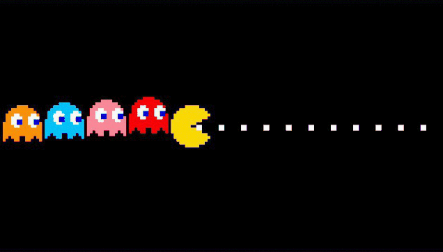
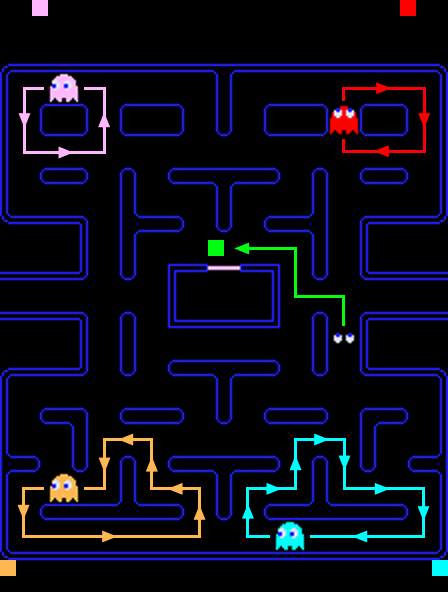

# Trabajo Práctico Final: Pac-Man

## Grupo 10: Alba Camila, Argüello Paola, Palavecino Ana Sofía

Este proyecto consiste en una versión jugable de Pac-Man en Python utilizando la librería PyGame. El objetivo fue reproducir la jugabilidad del juego original de Namco (1980), incluyendo el movimiento del personaje, las velocidades y los tiempos, la recolección de puntos y un sistema avanzado de inteligencia artificial para el comportamiento dinámico de los fantasmas.

   

## Características del Juego

* **Mapa del juego:** consiste en un archivo de texto (.txt) que se carga al iniciar el juego.
* **Pac-Man:** se mueve continuamente en la dirección indicada por el jugador. El jugador puede “pre-ingresar” la próxima dirección. El jugador comienza con 3 vidas. Pierde una vida cada vez que un fantasma activo lo toca. Al perder todas las vidas, el juego termina (Game Over). Si Pac-Man consume todos los puntos del nivel, el juego se reinicia avanzando al siguiente nivel.
* **Inteligencia Artificial Clásica:** los fantasmas cuentan con 3 modos lógicos de comportamiento automatizado:
    * **Chase:** sus tiles objetivo se basan en la posición de Pac-Man en el mapa.
        + **<u>Blinky (rojo):</u>** su tile objetivo es la posición actual de Pac-Man.
        + **<u>Pinky (rosado):</u>** su tile objetivo es el tile ubicado 4 posiciones adelante de la dirección actual de Pac-Man. Intenta cortarle el paso por delante.
        + **<u>Inky (celeste):</u>** su tile objetivo se calcula en dos pasos: primero se toma el tile ubicado 2 posiciones adelante de Pac-Man; luego se traza un vector desde la posición de Blinky hasta ese tile y se duplica. Si Blinky no está en la partida, se utiliza al azar alguno de los otros fantasmas.
        + **<u>Clyde (naranja):</u>** si su distancia a Pac-Man es mayor a 8 tiles, su target es la posición de Pac-Man. Si está a 8 tiles o menos, su target pasa a ser su esquina de Scatter. Evita acercarse demasiado.
        + **<u>Silly (lila):</u>** elige una dirección aleatoria válida.
        + **<u>Mysterious (verde):</u>** se "teletransporta" moviendose de a 3 casilleros.
    * **Scatter:** cada fantasma tiene un tile objetivo fijo, ubicado en una de las cuatro esquinas del mapa.
    

    
    

    
    * **Asustado:** al consumir un power pellet, todos los fantasmas activos invierten su dirección, cambian de color y eligen direcciones al azar en las intersecciones. 
* **Ciclo de Vida de los Fantasmas:** al ser devorados por Pac-Man, se convierten en ojos dinámicos orientados hacia su dirección de movimiento que viajan de regreso a la *Ghost House* para regenerarse.
* **Efectos de Sonido:** totalmente integrado con audios arcade para la muerte, el consumo de puntos y los estados especiales.

---
